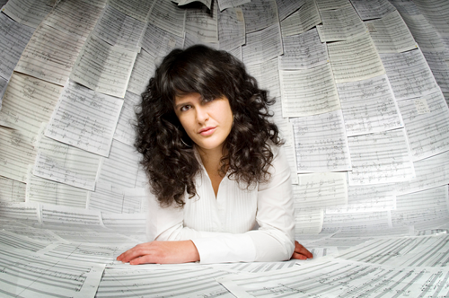

import DataWrapper from '../../../src/components/datawrapper/datawrapper.jsx'
import Accordion from '../../../src/components/accordion/accordion.jsx'
import Quote from '../../../src/components/quote/quote.jsx'

# Opernspielpläne in NRW: tot und männlich

## Wir haben die Spielpläne der kommunalen Opern-Bühnen in NRW abgefragt und analysiert.

Vorweg: Wir jammern auf hohem Niveau. Denn alles in allem steht es gut um die Oper in NRW. In der letzten Spielzeit gab es an 13 kommunalen Häusern über hundert Inszenierungen mit mehr als tausend Aufführungen.

## 3 Opern am Tag in NRW
In anderen Worten: Opernfreunde hatten im Schnitt jeden Tag die Wahl zwischen rund drei Opernaufführungen.

## Im Schnitt 180 Jahre alt
So vielfältig, wie es sich auf den ersten Blick darstellt, ist das Angebot aber keinesfalls. Denn meistens begegnet das Publikum alten Bekannten.

### Ältere werden häufiger aufgeführt

 Zu sehen ist das Geburtsjahr im Verhältnis zur Zahl der Aufführungen. Gelbe Quadrate stehen für lebende KomponistInnen, blaue Punkte für verstorbene. Klicken Sie darauf, um Name, Geburtsjahr und Zahl der Aufführungen zu sehen.

<DataWrapper
    aria-label="Während lebende KomponistInnen oft nur 1-2 mal aufgeführt werden, werden Komponisten, die über 150 Jahre alt sind besonders häufig aufgeführt. Spitzenreiter sind Guiseppe Verdi und Wolfgang Amadeus Mozart."
    title="Ältere KomponistInnen werden häufiger aufgeführt"
    src="//datawrapper.dwcdn.net/48hJE/10/"
/>

Claudio Monteverdi war mit 425 Jahren der älteste gespielte Komponist 2018/19. Leonard Evers mit 34 der jüngste. Der Komponist Moritz Eggert wirft den deutschen Opernhäusern mangelnde Innovationskraft vor.

<Quote author={
        <a href="https://blogs.nmz.de/badblog/2018/04/10/die-ernuechternde-opernstatistik-der-spielzeit-2017-2018/" target="_blank" rel="noopener">Moritz Eggert</a>
    }>Überlebenschance der Gattung Oper, wenn sich nicht grundlegend etwas ändert: 0%</Quote>

Ist die Opernwelt im 19. Jahrhundert stehen geblieben? Immerhin jede dritte der gespielten KomponistInnen ist nach 1919 geboren. Betrachtet man aber die Gesamtzahl aller Aufführungen, so sinkt das Verhältnis deutlich.

### Jede dritte KomponistIn wurde vor 1919 geboren, aber nur 12 % der Aufführungen stammen von ihnen

 Bei Klick auf 'KomponistInnen' ist zu sehen, wie das Verhältnis von älteren zu jüngeren KomponistInnen ist.

<DataWrapper
    aria-label="Jede 3. KomponistIn wurde vor 1919 geboren, aber nur 12 % der Aufführung stammen von ihnen."
    title="Nur 12 % der Aufführungen stammen von KomponistInnen, die jünger als 100 Jahre alt sind"
    src="//datawrapper.dwcdn.net/6D2bM/3/"
/>

Bei den lebenden Komponisten sind es vor allem Premieren von Uraufführungen, die aber nach wenigen Aufführungen wieder vom Spielplan verschwinden. Ein Verhältnis sticht außerdem sehr ins Auge:

### Nuria Núñez Hierro ist die einzige Frau

Hierros Kinderoper “Kleines Stück Himmel” wurde in Wuppertal acht mal aufgeführt.

<DataWrapper
    aria-label="In der Spielzeit 2018/2019 war unter 66 KomponistInnen nur eine Frau."
    title="Nuria Nunez Hierro ist die einzige Frau"
    src="//datawrapper.dwcdn.net/T56o1/2/"
/>

Nuria Núñez Hierro wurde 1980 in Jerez (Spanien) geboren.

Komponistin Nunez Herero fordert daher eine Quote für Frauen auf den Spielplänen.

<Quote author="Platzhalter Nura Nunez Hierro">Es gibt so viele gute Komponistinnen. Dass noch immer keine gespielt werden, ist ein Skandal!</Quote>

Beim Blick auf die Herkunft der KomponistInnen liegt das Zentrum weiterhin klar in Europa.

### Europa im Zentrum

Die meisten KomponistInnen sind in Europa geboren, einige stammen jedoch aus der ganzen Welt.

<DataWrapper
    aria-label="Nur wenige KomponistInnen stammen nicht aus Europa."
    title="Europa im Zentrum"
    src="//datawrapper.dwcdn.net/OttGi/1/"
/>

<DataWrapper
    aria-label="Einzelne KomponistInnen kommen aus der ganzen Welt."
    title="Nuria Nunez Hierro ist die einzige Frau"
    src="//datawrapper.dwcdn.net/qWU0T/4/"
/>

Die Opern begründen ihre konservativen Spielpläne mit dem politischen Druck, die Auslastungszahlen hoch zu halten.

<Quote author="Platzhalter Intendant Oper Wuppertal">Die Leute lieben eben Verdi. Mit zeitgenössischer Musik verschrecken Sie die Zuhörer!</Quote>

[Häuser im Vergleich]

Und so bieten die Spielpläne ein gewohntes Bild. Zum Abschluss zeigen wir alle Opern der NRW-Spielzeit in einer Grafik, sortiert nach Anzahl der Aufführungen.

### Zauberflöte vor Hänsel und Gretel

Wurde das Stück auch 'für Kinder' angeboten, haben wir es hier mit zusammen gefasst. Klicken sie auf einen Punkt, um die Anzahl der Aufführungen einzublenden. Kennen Sie die Opern? Haben sie die Melodien im Ohr?

<DataWrapper
    aria-label="76 mal wurde die Zauberflöte 2018/2019 in NRW aufgeführt, gefolgt von Hänsel und Gretel mit 34 Aufführungen."
    title="Zauberflöte vor Hänsel und Gretel"
    src="//datawrapper.dwcdn.net/azwpu/4/"
/>
